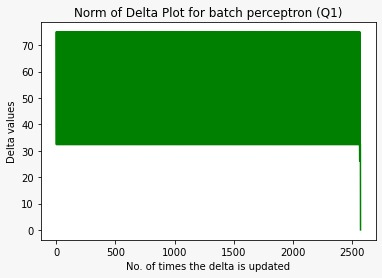
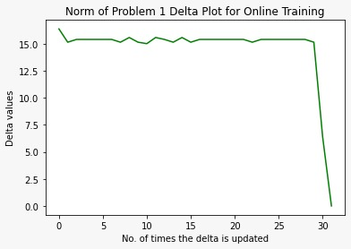
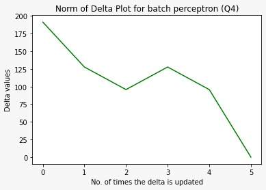
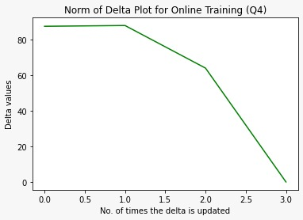
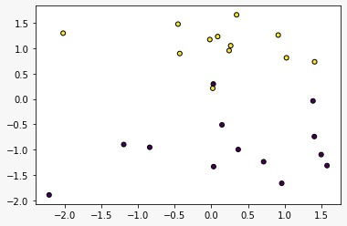
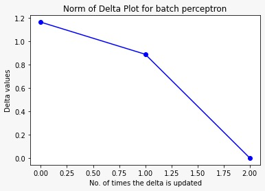
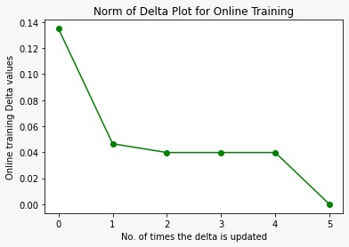
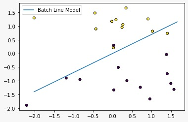
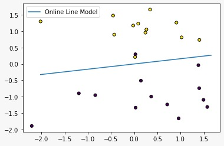

# **Assignment 1 Report**

## *Team Members:*

 ### **1. Hendwan Abozide   1170463** 
 ### **2. Rokaia Mohamed    1170193**

#

## ***Part 1***
#

## **Batch Algorithm**

```py
    def batch_perceptron ( X , Y, w):
    .
    .
    .
    while ( norm(delta,1) > e):
        delta = np.zeros(n)
        
        for i in range(len(X)):
            
            if Y[i] * (w.dot(X[i])) <= 0:
                
                delta = delta - ( Y[i] * X[i] )
            
        delta = delta/len(X)
        norm_delta.append(norm(delta,1))      
        epoch=epoch +1                         
        w = w - (alpha * delta)                
        w_update.append(w)

```

```py
N = X.shape[1]
Weight = np.random.uniform(-1, 1, N)            

```

## **Batch Code Explaination**
# 

- In Batch Algorithm, we first initialize the weights as a random variables that ranges from -1 to 1 and we pass it as a paramter to the function.

- Then we check if the norm of delta is greater than "e", which is a very small number (nearly zero), if true: 

- We iterate over the length of the input feature "X", if "Y" , (The output), times (WX) is less than 0, then update the delta.

- After all iterations, we will append the norm of delta to an array to plotted later annd we will have a new updated weight value, calculated by by subtracting from it alpha (learning rate) * the final delta value form the iterations. 

- Finally, we append the new W value to a new array to output it.


#
## **Online Training Algorithm**

```py
def online_batch_perceptron ( X , Y ,w):
.
.
.
for i in range(len(X)): 
    
    if Y[i] * (w.dot(X[i])) <= 0:
            
        online_delta = online_delta - ( Y[i] * X[i] )
        online_delta = online_delta/online_data_length
        
        
        w = w - (alpha * online_delta)
        online_w_steps.append(w)

online_norm_delta.append(norm(online_delta,1))
online_epoch=online_epoch+1

```

## **Online Algorithm Code Explaination**
# 

- It is the same as Batch Algorithm. The difference is that the updated weights are calculated in **each iteration**.

- We also append the value of norm delta after all iterations is done, to new array to be plotted.

## **Examples of Possible Outputs**
# 

 - ### **Question 1 Batch Output Example**


```
for Question 1 and weights [ 0.40877614 -0.74055917] the result in batch was 
Value of W after all iterations:  [ -5.84122386 513.13444083]
No. of times wights are updated:  2571
No. of times delta value is updated:  2571
Total No. of iterations (epoch) :  2571

```


- ### **Question 1 Online Output Example**

```
for Question 1 and weights [ 0.40877614 -0.74055917] the result in online training was

Value of W after all iterations:  [-0.04288402  4.41935294]
No. of times wights are updated:  93
No. of times delta value is updated:  32
Total No. of iterations (epoch) :  32
```



- ### **Question 4 Batch Output Example**

```
for Question 4 and weights [-0.18211555 -0.95663238  0.5742551   0.30411236] the result in batch was 

Value of W after all iterations:  [ 63.56788445  94.66836762 -95.0507449    0.30411236]
No. of times wights are updated:  6
No. of times delta value is updated:  6
Total No. of iterations (epoch) :  6

```



- ### **Question 4 Online Output Example**


```

for Question 4 and weights [-0.18211555 -0.95663238  0.5742551   0.30411236] the result in online training was

Value of W after all iterations:  [ 64.13596917  31.47867035 -75.62691677   0.29095928]
No. of times wights are updated:  8
No. of times delta value is updated:  4
Total No. of iterations (epoch) :  4

```




## ***Part 2 - Classification***
#

## **Classification Part**
#

### **Make_Classification Model Example**




- We used **train_test_split** function to split the data into **75%** trainind data and **25%** testing data.

    ```py
    X_train, X_test, Y_train, Y_test = train_test_split(X, Y, test_size=0.25)
    ```
    
- We used the **X_train** to get the previous outputs again **(Weights, No. of times wights are updated, No. of times delta value is updated & epoch)**


### **Batch Algorithm Output Example**

    
```
Value of W after all iterations:  [0.0834248  0.66469841]
No. of times weights are updated:  3
No. of times delta value is updated:  3
Total No. of iterations (epoch) :  3
```


### **Online Training Algorithm Output Example**

```
Value of W after all iterations:  [0.11773968 0.34998725]
No. of times weights are updated:  21
No. of times delta value is updated:  6
Total No. of iterations (epoch) :  6

```



### **Accuracy Calculation**

We used two libraries to calculate the accuracy

```py
from sklearn.metrics import accuracy_score
from sklearn.linear_model import LogisticRegression
```
```py
print('Accuracy Percentage of the Model = ', 100* (accuracy_score(Y_test, y_pred)))
```
After calculating getting T_test & y_pred, we used **accuracy_score** to calculate the accouracy and multiplied it by 100 to get the percentage.

### **Visualization of Model for Batch Algorithm**



### **Visualization of Model for Online Algorithm**



## **Comparision**
# 

- Delta must reach zero in both algorithms so that no new delta values are calculated and that the final value of weights is reached.

- We calculate the epoch ( No. of times a complete passing through the dataset ) in each algorithm:

    - In Batch, since **all outputs** (the no. of times weights and delta are updated & no. of epoch), are calculated after all iteration, all three values are **equal**.

    - In Online, no. of times delta is updated equal to no. of epoch since both are calulated after all iterations, and they are less than the value of times weights were updated.

- In Question 1, the iterations in Online algorithms were less than the bath algorithm.

- We noticed than when the no. of features **increases**, the number of iterations **decreases**


